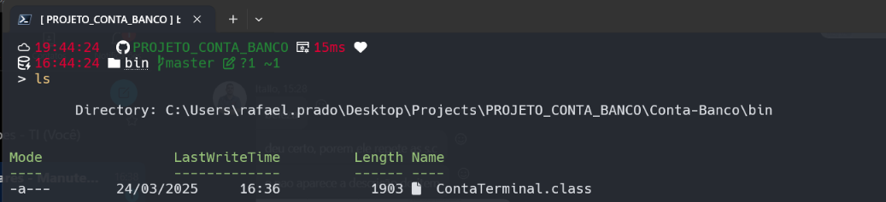
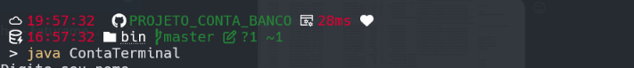

Seguindo as regras propostas 

# REPOSITÓRIO BASE
[Repositório-base](https://github.com/digitalinnovationone/trilha-java-basico/tree/main/desafios/sintaxe)

Para execução do projeto basta fazer um clone do projeto, pelo terminal navegar até pasta <b>bin</b> digitar o comando <b>java ContaTerminal</b>.

Navegando até a pasta bin

 

Executando o projeto

 

Esse projeto simula uma criação de uma conta bancario bem simples, porém da para ver a efetivação aconteçendo no terminal com a interação do usuario. 

